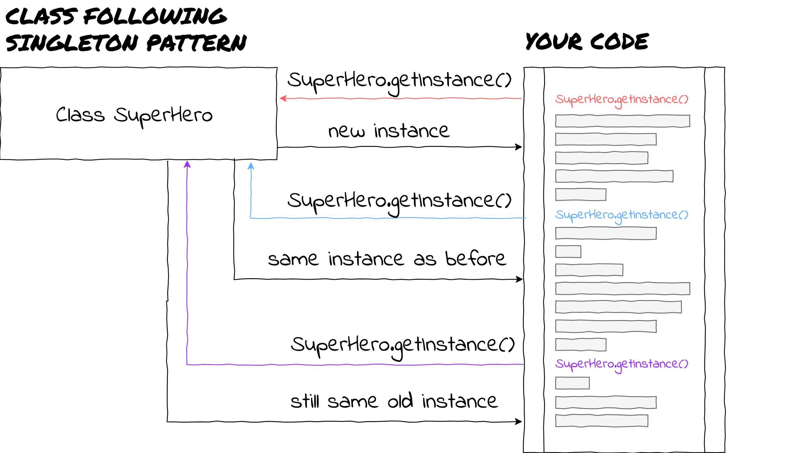
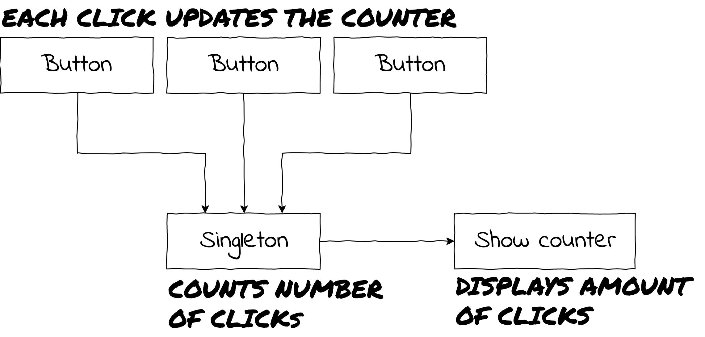
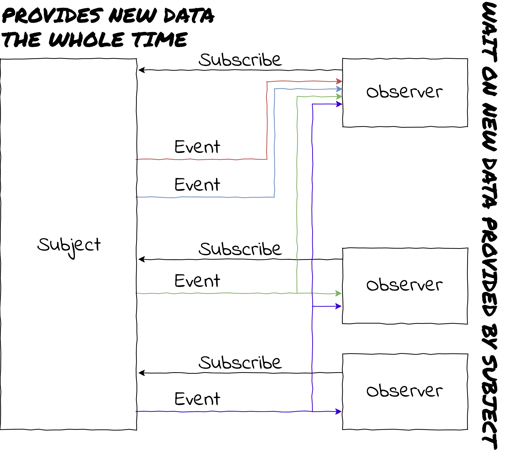
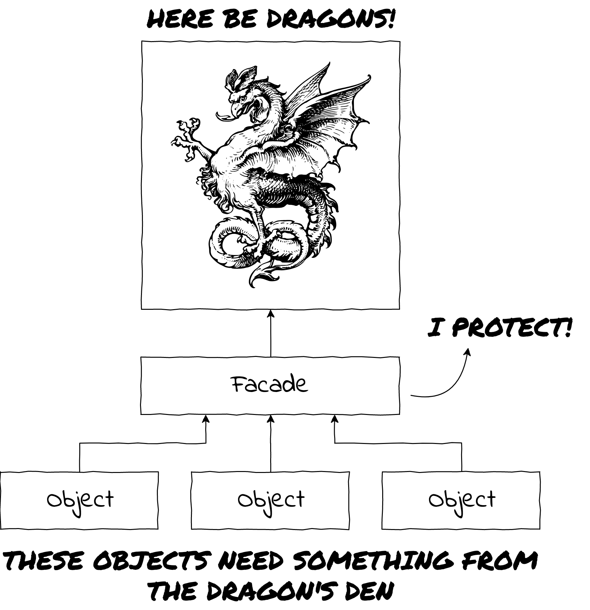
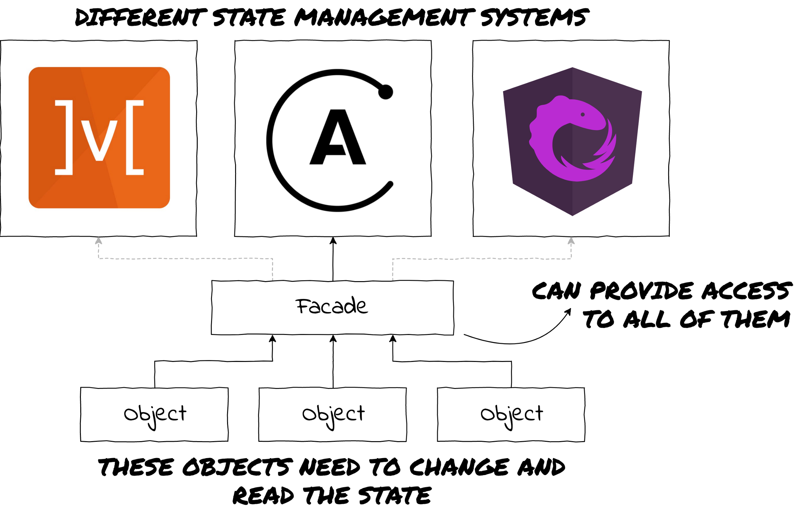

Мысли об эффективной коммуникации при разработке программных продуктов.

*Перевод [Design patterns in modern JavaScript development](https://levelup.gitconnected.com/design-patterns-in-modern-javascript-development-ec84d8be06ca)*

## Паттерны? Дизайн? Мы точно о разработке говорим?

### Определенно.

В случае объектно-ориентированного программирования, мы, разработчики, пытаемся моделировать окружающий нас мир. И поскольку это так, имеет смысл также попробовать использовать окружающий нас мир для описания нашего кода.

Мы можем обратиться к архитектуре (ту, где есть здания и мосты) и фундаментальной книге, которая называется **Язык Шаблонов: Города, Здания, Кристофера Александра, Сары Исикавы, Миррея Сильверстайна**, где шаблоны описаны следующим образом:

> Каждый шаблон описывает проблему, которая появляется снова и снова в нашем окружении, и затем описывает основу решения этой проблемы таким образом, что вы можете использовать это решение миллионы раз, ни разу не повторившись.

В программировании, архитектура — это процесс создания здорового, надежного и поддерживаемого приложения, и шаблоны предоставляют способ именования решений общих проблем. Эти решения могут варьироваться от абстрактных/теоретических до очень точных и технических, и позволяют разработчикам эффективнее общаться друг с другом.

Если два и более разработчика в команде осведомлены о шаблонах, вести разговор о решениях проблем получается очень эффективно. Однако если о шаблонах знает всего один, объяснить их остальной части команды обычно не сложно.

**Цель этой статьи — пробудить ваш аппетит, познакомив вас с идеей шаблонов проектирования и представив паттерны, которые являются интересными потому что используются довольно часто в современных JavaScript проектах.**

## Шаблон Singleton (одиночка)

### Что

Шаблон singleton не является одним из наиболее часто используемых, но мы начинаем с него, потому что его довольно просто понять.

Шаблон singleton происходит из математического понятия:

> В математике singleton — это множество состоящее из одного элемента. Например, множество `{null}` — это singleton.

В программировании это означает, что мы просто ограничиваем инициализацию класса единственным объектом. Когда объект класса реализующего шаблон singleton должен быть инициализирован в первый раз, он на самом деле инициализируется. Любая последующая попытка приведет к возврату этого первого экземпляра.

*Кому нужны 2 супергероя, когда есть Бэтмен?*

### Зачем

Кроме того что он позволяет нам всегда иметь единственного супергероя (которым всегда, очевидно, будет Бэтмен), зачем нам может понадобиться использовать singleton?

Хотя singleton — шаблон не без проблем (его прозвали злом, а объекты реализующие его — патологическими лгунами), ему все еще находят применение. Самое очевидное — создание конфигурационных объектов. Вы скорее всего хотите иметь один экземпляр конфига для всего приложения, если только предоставление множественных конфигураций — это не одна их возможностей вашего приложения.

### Где

Сервисы в Angular — яркий пример шаблона singleton, используемого в большом и популярном фреймворке. В документации Angular есть [отдельная страница](https://angular.io/guide/singleton-services) объясняющая как убедиться в том, что сервис всегда предоставляется как singleton

Сервисы являющиеся одиночками имеют большой смысл, поскольку используются как место для хранения стейта, конфигурации и связи между компонентами, и вы хотите убедиться что несколько экземпляров не привнесут путаницу эти понятия.

В качестве примера, предположим, у вас есть тривиальное приложение, которое используется для подсчета количества нажатий кнопки.

Вам нужно хранить количество нажатий на кнопку в одном объекте, который предоставляет:

- функционал для подсчета
- текущее количество кликов

Если бы объект не был синглтоном (и каждая кнопка получит свой собственный экземпляр), подсчет кликов не был бы корректным. Кроме всего прочего, который из экземпляров вы бы передали в компонент, отображающий текущее количество кликов?

## Шаблон Observer (наблюдатель)

### Что

Шаблон наблюдателя определяется следующим образом:

> Шаблон observer — это шаблон проектирования программного обеспечения, в котором объект, называемый субъектом, ведет список зависящих от него объектов, называемых наблюдателями, и автоматически уведомляет их о любых изменениях состояния, обычно вызывая один из их методов.

Шаблон observer действительно легко понять, если мы попытаемся сравнить его с примером из реально мира — подписками на газеты.

Обычный сценарий покупки газеты заключается в том, что вы идете к газетному киоску и спрашиваете, вышел ли новый номер вашей любимой газеты. Если нет, то это печально и вам придется идти домой и попробовать снова позже. В терминах JavaScript это будет то же самое что и цикл, исполняющий до тех пор, пока желаемый результат не будет получен.

Когда вы наконец-то добрались до газеты, вы вольны делать то, что планировали сделать с ней все это время — сесть и наслаждаться газетой за чашечкой кофе (или, с точки зрения JavaScript, исполнить колбэк).

Самое разумное что можно сделать (и получать вашу любимую газету ежедневно), это оформить на нее подписку.

Таким образом, издательство сообщит вам, когда выйдет новый номер газеты, и доставит его. Больше не нужно бежать в газетный киоск. Никаких разочарований. Блаженство.

В терминах JavaScript это означает, что вам больше не нужно в цикле опрашивать результат, чтобы запустить колбэк.

Вместо этого вы должны сообщить субъекту, что вы заинтересованы в определенных событиях (сообщениях) и предоставить ему колбэк, который должен быть вызван когда новые данные будут готовы. Теперь вы являетесь наблюдателем.

*Никогда больше не пропускайте свою утреннюю газету*

Приятно то, что вам не обязательно быть единственным подписчиком. Другие люди тоже будут разочарованы отсутствием газеты, как и вы. Вот почему много наблюдателей могут подписаться на событие.

### Зачем

Шаблон наблюдателя имеет много вариантов использования, но, как правило, его следует использовать, когда вы хотите создать зависимость один-ко-многим (one-to-many) между объектами, которые не являются тесно связанными и имеют возможность уведомлять неограниченное число объектов об изменении состояния.

JavaScript — отличное место для шаблона observer, потому что все зависит от событий (event-driven), и вместо того, чтобы постоянно спрашивать, не произошло ли событие, вы должны позволить событию оповестить вас («Меня никак не зовут, я сам прихожу»).

Скорее всего, вы уже делали что-то похожее на паттерн observer — `addEventListener`. Добавление слушателя события на элемент имеет все признаки наблюдателя:

- вы можете подписаться на объект
- вы можете отписаться от объекта
- и объект может оповещать о событии всех своих подписчиков

Большая выгода от изучения этого шаблона в том, что вы сможете реализовать свое собственное решение, или освоить существующее гораздо быстрее.

### Где

Реализация базового паттерна не должна быть слишком сложной, но есть большая библиотека, используемая многими проектами, и это [ReactiveX](http://reactivex.io/), аналогом которой в JavaScript является [RxJS](https://rxjs.dev/).

RxJS позволяет вам не только подписываться на события, но также дает вам возможность преобразовывать данные любыми способами, которые вы только можете себе представить, объединяя несколько подписок, делая асинхронную работу более управляемой и много чего еще. Если вы когда-нибудь хотели поднять уровень обработки и преобразования данных на более высокий уровень, RxJS была бы отличной библиотекой для изучения.

Помимо шаблона observer, ReactiveX также гордится реализацией шаблона iterator, который дает субъектам возможность сообщать своим подписчикам, когда подписка закончилась, эффективно завершая подписку со стороны субъекта. Я не буду объяснять шаблон итератора в этой статье, но для вас было бы очень полезно узнать о нем больше и посмотреть, как он вписывается в паттерн наблюдатель.

## Паттерн Facade (фасад)

### Что

Фасад — это паттерн, который берет свое название из архитектуры.

> Фасад — это, как правило, одна из внешних сторон здания, обычно передняя. Это слово заимствовано из французского «façade», что означает «палисадник» или «лицо».

Поскольку в архитектуре фасад — это внешняя часть здания, прячущая за собой его внутреннее устройство, шаблон фасад в разработке программного обеспечения пытается скрыть за собой лежащую в основе чего-либо сложность, давая вам возможность работать с API, который легче понять, и одновременно позволяя изменять базовый код на ваше усмотрение.

### Зачем

Вы можете использовать этот паттерн в несметном множестве ситуаций, но наиболее заметными из них будут упрощение понимания вашего кода (скрытие сложности) и создание минимально связанных частей приложений.

*Fus Ro Dah!*

Легко понять, почему фасад (или слой со множеством объектов) будет хорош в этой ситуации. Вы не захотите иметь дело с драконами, если этого можно избежать. Объект фасада предоставит вам хороший API и сам разберется со всеми драконьими выходками.

Еще одна замечательная вещь, которую мы можем сделать, это заменить дракона, даже не касаясь остальной части приложения. Допустим, вы хотите заменить этого дракона котенком. У него все еще есть когти, но его легче кормить. Чтобы изменить его, нужно переписать код на фасаде без изменения каких-либо зависимых объектов.

### Где

Место, где вы часто будете видеть фасады, — это Angular, использующий его сервисы как средство упрощения бизнес логики. Но как вы увидите в следующем примере, это не обязательно должен быть Angular.

Допустим, вы хотите добавить управление состоянием в ваше приложение. Вы можете взять Redux, NgRx, Akita, MobX, Apollo или любую другую библиотеку, которые появляются то там, то здесь. Ну, а почему бы не взять их всех и не попробовать?

Каким базовым функционалом должна обладать библиотека для управления состоянием?

Вероятно:
- способ сообщить что вы хотите внести в стейт какие-то изменения
- и способ получения текущего (кусочка) состояния.

Звучит не так уж плохо.

Теперь, обладая силой паттерна Facade, вы можете написать по фасаду для каждой из частей стейта, которые предоставят удобный API для работы с ними. Что-то вроде `facade.startSpinner()`, `facade.stopSpinner()` и `facade.getSpinnerState()`.

Эти методы действительно легко понять и аргументировать.

После этого вы можете заняться фасадом и написать код, который преобразует его так, чтобы он работал с Apollo (GraphQL сейчас в тренде). Возможно вы поймете, что он не подходит под ваш стиль написания кода, или что процесс написания Unit тестов - не то что вы ожидали. Без проблем — напишите новый фасад, который будет поддерживать работу с MobX.

*Тут могли быть драконы...*

## Куда идти дальше

Вы, наверное, заметили, что не было ни кода, ни реализации шаблонов, о которых я говорил. Это потому, что для описания каждого из этих паттенов может потребоваться целая глава книги, как минимум.

Поскольку мы заговорили о книгах, не мешало бы взглянуть на одну или две, посвященным паттернам проектирования.

Первой и самой большой рекомендацией будет [Приёмы объектно-ориентированного проектирования. Паттерны проектирования](http://wiki.c2.com/?DesignPatternsBook) *Эриха Гаммы, Ричарда Хелма, Ральфа Джонсона* и *Джона Флиссайда*, также известных как *«Банда четырех»*. Книга является золотой жилой и де-факто библией шаблонов проектирования программного обеспечения.

Если вы ищете что-то, что немного легче усваивается, то есть [Head First Паттерны проектирования](https://www.goodreads.com/book/show/58128.Head_First_Design_Patterns) *Берт Бейтс, Кэти Сьерра, Эрик Фриман* и *Элизабет Робсон*. Это очень хорошая книга, которая пытается передать смысл паттернов через визуальную перспективу.

**И последнее, но не менее важное: ничто не сравнится с поиском в Google, чтением и опробованием разных подходов. Даже если вы в конечном итоге никогда не используете шаблон или технику, вы чему-то научитесь и будете расти так, как вы никогда не ожидали.**

*Фигуры диалогов, использованные в иллюстрациях, созданы [starline — www.freepik.com](https://www.freepik.com/free-photos-vectors/frame).*